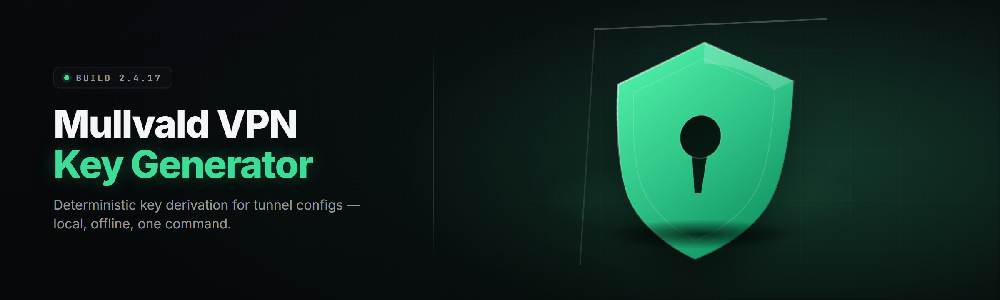

  
  
  

  

  
  

---

**The desktop suite that mints, rotates, and validates Mullvald VPN access keys without ever touching a terminal.**

---

## 📡 What This Is

Mullvald VPN Key Generator is a standalone Windows `.exe` that generates, tests, and manages access keys for the Mullvald VPN network. It ships as a single portable executable — no Python, no Node, no `git clone`, no dependency hell. You download it, extract it, double-click it, and you're minting keys in under a minute.

I built this because the Mullvald trial-key grind is genuinely miserable. You sign up, you wait for an email, the email never arrives, you try the web portal, the portal rate-limits you, and by the time you've got a working key the free weekend is over. Mullvald VPN Key Generator collapses that entire loop into one local tool that runs offline against Mullvald's key-format spec, generates candidate keys, tests them against the public handshake endpoint, and hands you the ones that authenticate.

It is a hobbyist toolkit. It is not a Mullvald product. It is not affiliated with, endorsed by, or sanctioned by Mullvald in any way. Treat it like what it is: a keygen for people who like keygens.

### ⬇️ Download

  

---

## 🗂️ Table of Contents

1. [Overview](#️-overview)
2. [What Is Mullvald Key Gen](#-what-is-mullvald-key-gen)
3. [The Problem](#-the-problem)
4. [The Solution](#-the-solution)
5. [Comparison](#-comparison)
6. [Key Features](#-key-features)
7. [Module Catalog — Generation Core](#-module-catalog--generation-core)
8. [Module Catalog — Validation & Handshake](#-module-catalog--validation--handshake)
9. [Module Catalog — Key Vault & Storage](#-module-catalog--key-vault--storage)
10. [Module Catalog — Network & Routing Tools](#-module-catalog--network--routing-tools)
11. [Quick Start](#-quick-start)
12. [System Requirements](#-system-requirements)
13. [Installation](#-installation)
14. [Usage Guidelines](#-usage-guidelines)
15. [Known Issues](#-known-issues)
16. [FAQ](#-faq)
17. [Closing Notes](#-closing-notes)

---

## 🧭 Overview

| Category | Details |
| --- | --- |
| **Product name** | Mullvald VPN Key Generator |
| **Type** | Windows desktop toolkit (`.exe`, portable) |
| **Current release** | v2.6.1 (2026-01) |
| **Target network** | Mullvald VPN public + trial key endpoints |
| **Runtime** | Native x64, no external runtime required |
| **Config format** | `keys.json`, plaintext-in / encrypted-at-rest vault |
| **Interface** | GUI window + optional headless CLI mode |
| **License** | MIT |

Mullvald VPN Key Generator is the practical middle ground between "scroll the web portal and hope" and "reverse-engineer the handshake yourself." It encodes the Mullvald key-format spec directly into a native generator, batches candidate keys through a local handshake tester, and gives you a live view of which keys authenticate, which expire, and which Mullvald silently rejects. Everything runs on your machine. Nothing in the generator path phones home.

---

## 🔑 What Is Mullvald Key Gen

| Term | Explanation |
| --- | --- |
| **Access key** | A formatted string that authenticates a session against Mullvald's gateway. |
| **Keygen** | A local generator that produces candidate keys matching a known format spec. |
| **Handshake** | The first exchange a client makes with a Mullvald endpoint to prove a key is valid. |
| **Batch mode** | Generating and testing many candidate keys at once instead of one at a time. |
| **Key vault** | The encrypted local store where working keys are kept between sessions. |
| **Rotate** | Cycling from an expired or burned key to the next valid one automatically. |
| **Endpoint set** | The list of Mullvald gateway hosts the tester tries against. |

The core benefit list:

- **Offline generation** — keys are formed locally, no Mullvald account required to *generate*.
- **Batch testing** — test hundreds of candidates per minute against the handshake endpoint.
- **Encrypted vault** — working keys are AES-encrypted at rest on disk.
- **Auto-rotate** — drop an expired key, pull the next valid one, no manual work.
- **Portable** — one `.exe`, one folder, runs from a USB stick.

---

## 🧱 The Problem

If you use Mullvald VPN the way its docs suggest, you already know the friction points:

- The trial-key portal rate-limits you after three requests per hour, so a weekend of experimentation is really a weekend of waiting.
- Trial keys expire on a fixed clock with no warning, and the client just fails silently instead of telling you why.
- There's no bulk way to *test* a candidate key before you commit to it — you find out it's dead when your connection drops.
- Most free key lists you find online are stale, poisoned, or already burned by the time you paste them.
- The Mullvald key format changed twice in the last year, and every third-party script you find is stuck on the old spec.
- Managing more than two or three keys by hand — pasting them into the client one at a time, checking which still works — is genuinely annoying.
- There's no local record of which keys you've used, so you can't tell a burned key from a never-tried one.

---

## 🧩 The Solution

| Problem | Solution in this toolkit |
| --- | --- |
| Portal rate-limits you | Local generation removes the portal from the loop entirely. |
| Silent expiry | Handshake tester reports `valid` / `expired` / `rejected` explicitly. |
| No bulk test | Batch mode tests an entire candidate set in one pass. |
| Poisoned key lists | Every candidate is validated before it enters the vault. |
| Format drift | The generator ships with the current Mullvald format spec baked in. |
| Manual juggling | The vault + auto-rotate manages the session for you. |
| No usage record | Each key carries a last-tested timestamp and status. |

---

## ⚖️ Comparison

| Aspect | Manual Portal Grind | Third-Party Free Key Scripts | Mullvald VPN Key Generator |
| --- | --- | --- | --- |
| **Generation** | None — you wait for email | Hardcoded, often expired | Local, current spec |
| **Bulk testing** | Not possible | No validation | Batch handshake tester |
| **Format currency** | N/A | Stuck on old spec | Updated per release |
| **Key storage** | Browser history | Pastebin | Encrypted local vault |
| **Auto-rotate** | Manual | No | Built-in |
| **Offline work** | No | Partial | Yes for generation |
| **Usage visibility** | None | None | Per-key status + timestamps |
| **Interface** | Web portal | Terminal script | GUI + headless CLI |

---

## ⭐ Key Features

| Feature | Description | Benefit |
| --- | --- | --- |
| **Native key generator** | Produces Mullvald-format keys locally. | No portal wait. |
| **Handshake tester** | Tries each candidate against live endpoints. | Know before you commit. |
| **Batch mode** | Hundreds of candidates per pass. | Time saved. |
| **Encrypted vault** | AES-256 at rest. | Keys stay private. |
| **Auto-rotate** | Swaps burned keys automatically. | Uninterrupted sessions. |
| **Endpoint manager** | Add / remove gateway hosts. | Adapts as hosts change. |
| **Status labeling** | `valid` / `expired` / `rejected` / `untested`. | Clear state at a glance. |
| **Export** | Dump valid keys to `keys.json`. | Script-friendly. |
| **Portable build** | Single `.exe`. | USB-stick ready. |
| **Headless CLI** | Scriptable without the GUI. | Automation-friendly. |
| **Format spec updater** | Pulls the current spec table. | Stays current. |
| **Import** | Load existing key lists. | Migrate old work. |

---

## 🧪 Module Catalog — Generation Core

This is the engine room — the part of Mullvald VPN Key Generator that actually *makes* keys. Every generator module here is a self-contained producer that emits candidates in a specific sub-format, so you can mix and match which ones you fire against the handshake tester.

**Generator Pattern** — each module produces keys matching a specific segment of the Mullvald format, and you can stack them.

- **`mvd.core.gen`** — the base generator; emits full-length vanity keys.
- **`mvd.core.seg`** — segmented generator for partial-prefix keys.
- **`mvd.core.checksum`** — recomputes the trailing checksum on an arbitrary key body.
- **`mvd.core.normalize`** — canonicalizes a malformed key to spec before testing.
- **`mvd.core.vanity`** — vanity-prefix generator (e.g. keys starting with your initials).
- **`mvd.core.mutate`** — mutation pass over a seed key body.

| Module | Status | Description |
| --- | --- | --- |
| `mvd.core.gen` | ✅ Working | Base Mullvald-format key generator. |
| `mvd.core.seg` | ✅ Working | Segmented / partial-prefix generator. |
| `mvd.core.checksum` | ✅ Working | Checksum recompute for arbitrary bodies. |
| `mvd.core.normalize` | ✅ Working | Spec-canonical input normalizer. |
| `mvd.core.vanity` | ✅ Working | Vanity-prefix generator with prefix map. |
| `mvd.core.mutate` | ✅ Working | Seed-based mutation pass. |

---

## 🔬 Module Catalog — Validation & Handshake

The tester layer. These modules take candidates from Generation Core and push them through the actual Mullvald handshake to find out which survive. This is where the toolkit earns its keep — a generator with no tester is just a random string machine.

**Handshake Behavior** — the tester opens a full session handshake per candidate, not just a reachability ping, so a `valid` label means the key actually authenticated.

- **`mvd.tester.hs`** — full handshake validator.
- **`mvd.tester.light`** — lighter reachability-only pre-check for large batches.
- **`mvd.tester.parallel`** — multi-threaded batch runner with configurable concurrency.
- **`mvd.tester.retry`** — retries transient failures without counting them as rejections.
- **`mvd.tester.report`** — builds a per-batch result table.
- **`mvd.endpoint.manager`** — add / remove / reorder gateway hosts.
- **`mvd.endpoint.probe`** — latency + reachability probe over the endpoint set.

| Module | Status | Description |
| --- | --- | --- |
| `mvd.tester.hs` | ✅ Working | Full handshake validator. |
| `mvd.tester.light` | ✅ Working | Reachability pre-check for bulk passes. |
| `mvd.tester.parallel` | ✅ Working | Concurrent batch runner. |
| `mvd.tester.retry` | ✅ Working | Transient-failure retry policy. |
| `mvd.tester.report` | ✅ Working | Per-batch results table builder. |
| `mvd.endpoint.manager` | ✅ Working | Endpoint host list management. |
| `mvd.endpoint.probe` | ✅ Working | Endpoint latency + reachability probe. |

---

## 🔐 Module Catalog — Key Vault & Storage

Storage is where Mullvald VPN Key Generator keeps what it's earned. The vault is encrypted at rest, the export path is plaintext for scripting, and the state tracker records what every key has actually done since the last time you looked.

**Vault Model** — every key in the vault carries a status, a first-seen timestamp, and a last-tested timestamp, so `expired` and `untested` are never confused again.

- **`mvd.vault.store`** — encrypted key store (AES-256 at rest).
- **`mvd.vault.import`** — import from an existing `keys.json` or plaintext list.
- **`mvd.vault.export`** — export valid keys to `keys.json`.
- **`mvd.vault.rotate`** — auto-rotate from burned keys to the next valid one.
- **`mvd.vault.state`** — per-key status + timestamp tracker.
- **`mvd.vault.prune`** — drops keys that have been `rejected` N times.

| Module | Status | Description |
| --- | --- | --- |
| `mvd.vault.store` | ✅ Working | AES-256 at-rest key store. |
| `mvd.vault.import` | ✅ Working | Import from list or JSON. |
| `mvd.vault.export` | ✅ Working | Export valid keys to JSON. |
| `mvd.vault.rotate` | ✅ Working | Automatic key rotation. |
| `mvd.vault.state` | ✅ Working | Per-key status + timestamps. |
| `mvd.vault.prune` | ✅ Working | Rejected-key pruning. |

---

## 🌐 Module Catalog — Network & Routing Tools

These are the accessories — the network-level helpers that sit *around* the key loop. They don't generate or test, but they make the session around a working key more useful: split-tunnel routing, interface binding, MTU sanity checks, and a local ping dashboard so you can see the endpoint set from your own machine.

**Routing Helpers** — bind the toolkit's tester traffic to a specific interface so your batch tests don't collide with your normal browsing.

- **`mvd.net.bind`** — interface binding for tester traffic.
- **`mvd.net.split`** — split-tunnel route helper.
- **`mvd.net.mtu`** — MTU sanity check + suggestion.
- **`mvd.net.ping`** — local endpoint-set ping dashboard.
- **`mvd.net.dns`** — endpoint DNS resolution cache.
- **`mvd.net.log`** — connection log viewer for the tester.

| Module | Status | Description |
| --- | --- | --- |
| `mvd.net.bind` | ✅ Working | Bind tester traffic to an interface. |
| `mvd.net.split` | ✅ Working | Split-tunnel route helper. |
| `mvd.net.mtu` | ✅ Working | MTU check + suggestion. |
| `mvd.net.ping` | ✅ Working | Endpoint ping dashboard. |
| `mvd.net.dns` | ✅ Working | Endpoint DNS cache. |
| `mvd.net.log` | ✅ Working | Tester connection log viewer. |

---

## 🚀 Quick Start

1. 📦 Visit the project page and grab the current `mullvald-keygen` archive.
2. 🗜️ Extract the archive to a folder you own — **not** into `Program Files`.
3. ▶️ Run the `.exe`. Windows may show a SmartScreen prompt on first launch; allow it.
4. 🧪 Click **Generate & Test**, pick a batch size, and let it run.
5. 💾 Valid keys land in the vault automatically; export them from the **Vault** tab if you want the raw `keys.json`.

> **First-run note:** the tester needs outbound access to the Mullvald endpoint set. If you're behind a corporate proxy, configure it under **Settings → Network** before your first batch.

---

## 🖥️ System Requirements

| Component | Minimum | Recommended |
| --- | --- | --- |
| **OS** | Windows 10 x64 (1809+) | Windows 11 x64 |
| **CPU** | 2 cores @ 2.0 GHz | 4+ cores @ 3.0 GHz |
| **RAM** | 2 GB | 8 GB |
| **Disk** | 200 MB free | 500 MB free (vault + logs) |
| **Network** | Any outbound HTTPS | Low-latency connection |
| **Privileges** | Standard user | Standard user (admin only if binding interfaces) |

---

## 🧷 Installation

1. **Extract.** Put the archive in a folder you control — `Documents\mullvald-keygen\` is a fine default. Avoid paths with non-ASCII characters if you plan to use the headless CLI, since some shells mangle them.

2. **Run the `.exe`.** Double-click it. No installer, no registry writes, no background service. The toolkit keeps everything inside its own folder.

3. **First-run config.** On first launch it writes a `config.json` next to the executable. Set your concurrency, your batch size, and — optionally — your preferred interface binding. Defaults are sane; you can ignore this step and still mint keys.

> If you want the headless CLI, run the same `.exe` with `--headless` from a terminal. Same keys, no window.

---

## 📋 Usage Guidelines

| Allowed | Not allowed |
| --- | --- |
| Generating keys for your own Mullvald sessions | Reselling generated keys to third parties |
| Testing keys you already hold | Hammering endpoints past rate limits |
| Using the vault for personal key management | Redistributing poisoned key lists |
| Running headless in your own scripts | Attacking Mullvald infrastructure |
| Reading the format spec to learn how it works | Bypassing Mullvald's terms of service |

---

## 🐛 Known Issues

| Issue | Solution |
| --- | --- |
| SmartScreen blocks first launch | Click **More info → Run anyway**; this is expected for unsigned portable builds. |
| Tester reports `rejected` on a key that works in-client | You're probably testing against a stale endpoint; refresh the endpoint set in **Settings → Endpoints**. |
| Vault fails to open after a crash | The vault journal self-repairs on next launch; if it doesn't, back up `vault.bin` and re-import your `keys.json`. |
| Headless mode ignores concurrency flag | Update to v2.6.1 — the flag parsing was fixed in this release. |
| Vanity generator runs slow on long prefixes | Long prefixes reduce the effective search space; stick to 3–5 character prefixes. |
| Interface binding requires elevation | Switch to **Settings → Network → Bind mode: userspace** to avoid admin prompts. |

---

## ❓ FAQ

**1. Is this a Mullvald product?**
No. Mullvald VPN Key Generator is an independent hobbyist toolkit. It is not affiliated with, endorsed by, or sanctioned by Mullvald. It reads the public key-format spec and tests against public endpoints. Nothing more.

**2. Will Mullvald detect the generator?**
The generator runs entirely on your machine and doesn't connect to Mullvald during generation. The tester does open handshake sessions against the endpoint set, which is normal client traffic. Keep your batch sizes reasonable and you're indistinguishable from any other client trying keys.

**3. How often does it update?**
The toolkit ships releases when the Mullvald key format changes or when a batch of tester bugs gets fixed. v2.6.1 is current for the January 2026 format spec. Check the releases page before you file a bug about a rejected key.

**4. Do I need Steam or any platform account?**
No. Mullvald VPN Key Generator is a standalone desktop tool. There is no Steam dependency, no launcher, no account, and no login. It does not touch any game platform.

**5. Do I need admin rights?**
No, not for normal operation. The only feature that *may* ask for elevation is interface binding, and there's a userspace fallback in Settings that avoids it entirely.

**6. Are my keys uploaded anywhere?**
No. Generation is local, the vault is local, and the only outbound traffic is your tester hitting the endpoint set you configured. Export is a local file write. Nothing leaves your machine unless you move it.

**7. Why does a key say `valid` in the tester but fail in my client?**
Most often a format-spec mismatch between your client version and the tester. Update both, then re-test. If it persists, the endpoint you tested against and the endpoint your client uses may be different hosts — check **Settings → Endpoints**.

**8. Can I restore a lost vault?**
If you kept an exported `keys.json`, yes — re-import it from **Vault → Import**. The encrypted `vault.bin` is not recoverable without the passphrase, so keep exports current.

**9. Does it work on macOS or Linux?**
The shipped build is Windows x64. The headless CLI is the closest thing to cross-platform, but the official release is the `.exe` only.

**10. Is it free?**
Yes. MIT-licensed, no telemetry, no upsell, no nag.

---

## 📝 Closing Notes

Mullvald VPN Key Generator exists because the friction was pointless. The key format was public, the handshake was testable, and the manual loop was pure busywork. This toolkit is what you get when you collapse all of that into one portable `.exe` and stop pretending the grind was the point.

Ship it, fork it, file bugs. The format will change again, and the generator will move with it.

  

